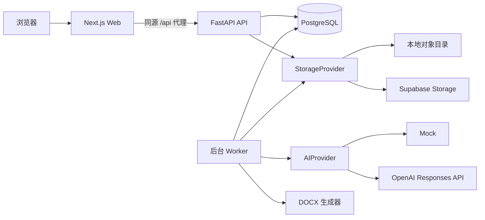

# 系统架构

## 组件

## 边界和数据流

1. 浏览器只访问 Next.js 源站，`/api/health/*` 和 `/api/v1/*` 被代理到 FastAPI。
2. FastAPI 负责认证、授权、输入校验、事务、审计和所有数据库写入。
3. 长耗时请求先创建 `AIJob`，Worker 使用行锁、`SKIP LOCKED` 和租约领取任务。
4. Worker 把模型输出写入草稿版本；人工审核接口在单个事务中发布正式版本。
5. 文件内容由存储适配器保存，数据库只记录 UUID 对象键、MIME、大小和摘要。
6. Supabase 仅替换 PostgreSQL 托管位置和对象存储适配器，不改变业务接口。

## API 约定

- 业务 API 前缀：`/api/v1`。
- 存活：`GET /health/live`；不访问外部依赖。
- 就绪：`GET /health/ready`；验证数据库与迁移版本。
- 时间：ISO 8601 UTC；前端按 `Asia/Shanghai` 展示。
- 错误：`{ code, message, request_id, details? }`，不得返回堆栈或 SQL。
- 并发编辑：后续版本实体使用版本号/当前版本指针检测过期保存。
- OpenAPI JSON 生成到 `packages/api-client/openapi.json`，TypeScript 类型生成到 `src/schema.d.ts`。

## AI 和提示词

- `AIProvider` 描述文本、结构化输出、视觉和取消能力。
- 开发/测试固定使用 Mock；OpenAI 适配器在 Phase 2 使用官方 SDK 与 Responses API。
- 模型、可用参数和密钥来自服务端配置；适配器按模型能力决定是否发送温度等可选参数。
- 任务日志只保存模板版本、上下文清单/摘要、用量和脱敏错误，不保存 API 密钥或完整个人资料。
- 提示词逻辑键及版本是唯一来源，领域代码不得拼接散落的长提示词。

## 部署演进

- 本地：Docker Compose 的 Web、API、Worker、Migrate、PostgreSQL。
- 远程：保持相同容器边界，在反向代理后启用 TLS；PostgreSQL/Storage 可切换 Supabase。
- 单用户规模不引入 Redis。若未来队列吞吐或任务调度超出 PostgreSQL Worker 能力，再以指标驱动迁移。
