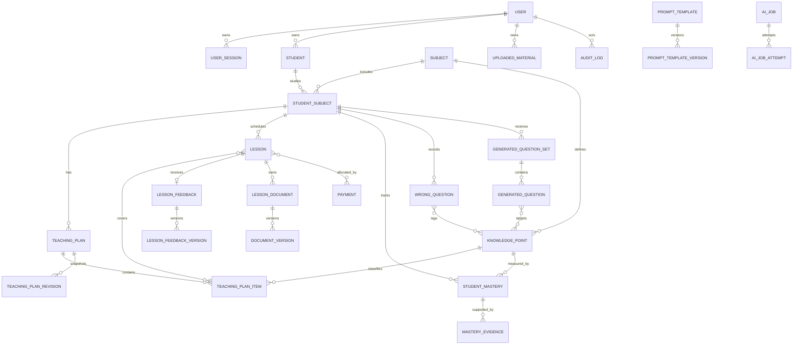

# 数据库 ER 设计

Phase 0 初始迁移创建 `User`、`UserSession`、`AIJob`、`AIJobAttempt`、`AuditLog`。Phase 1 已新增 `Subject`、`Student`、`StudentSubject`、`TeachingPlan`、`TeachingPlanItem`、`TeachingPlanRevision`、`Lesson` 和 `LessonPlanItem`；图中其余实体仍按后续阶段补充迁移。

## 实体归属和去重

- `Student` 保存代号、年级、地区、学校和通用学习特点；学科教材、基础、总目标、阶段目标及注意事项放在 `StudentSubject`。
- `Lesson` 仅引用 `StudentSubject`；不得再保存可漂移的学生和学科外键。
- `TeachingPlanItem` 支持父子层级、顺序、预计课时、实际进度及可选知识点。
- `TeachingPlanRevision` 保存每次人工批准后的计划快照和调整原因。
- `LessonFeedback` 是逻辑记录，`LessonFeedbackVersion` 保存关键词输入、AI 草稿、教师编辑和批准状态。
- `LessonDocument` 是逻辑文档，`DocumentVersion` 保存结构化内容和导出对象键。
- `StudentMastery` 保存当前结构化等级；`MasteryEvidence` 保存每次变更的来源、前后等级和原因。
- `Payment` 是实际到账交易；`PaymentAllocation` 保存分摊到课程的金额。付款状态由分摊合计计算。
- `AIJob` 是业务任务；每次提供商调用或 Worker 尝试写入 `AIJobAttempt`，避免重复 API 日志实体。

## 数据类型约定

- 主键为应用生成 UUID；对象存储键也使用 UUID 分段，不使用原文件名。
- 金额为整数分，币种为 ISO 4217；时长为整数分钟。
- 所有事件时间为带时区时间戳并按 UTC 写入。
- 可编辑正式记录包含版本号，版本表使用 `(parent_id, version_number)` 唯一约束。
- 重要实体使用 `archived_at` 软删除；不可变版本、付款和审计日志不做普通硬删除。

## 关键索引

- `student_subject(student_id, subject_id)` 唯一。
- `lesson(student_subject_id, scheduled_start)`、`lesson(status, scheduled_start)`。
- `teaching_plan_item(plan_id, parent_id, sort_order)`。
- `knowledge_point(subject_id, parent_id, normalized_name)` 受控唯一。
- `student_mastery(student_subject_id, knowledge_point_id)` 唯一。
- `wrong_question(student_subject_id, mastery_status, last_reviewed_at)`。
- `ai_job(status, available_at, created_at)` 及唯一幂等键。
- `payment_allocation(payment_id, lesson_id)` 唯一，并单独索引 `lesson_id`。
- `audit_log(entity_type, entity_id, created_at)`；上传文件索引 SHA-256。
